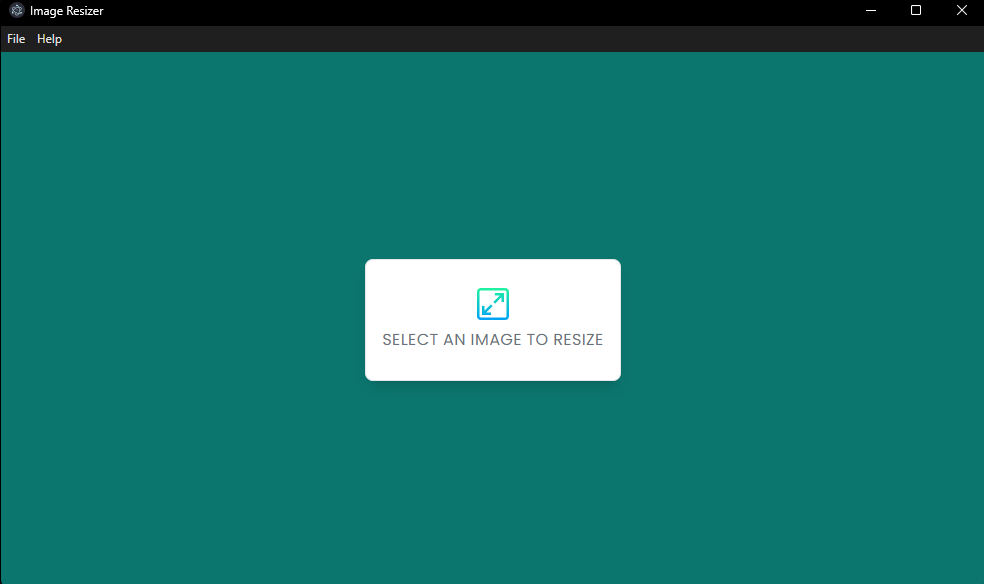
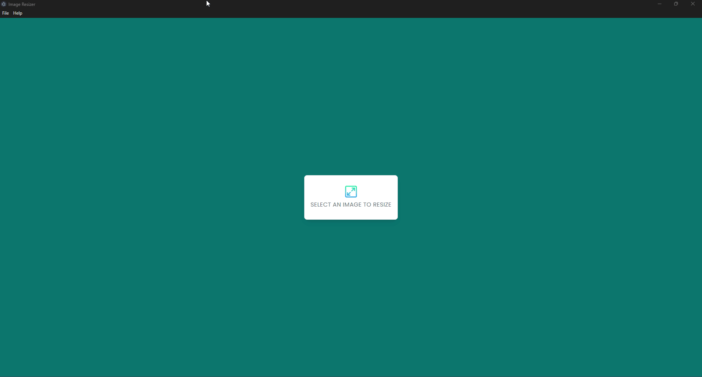

<h1 id="titulo" align="center"> IMAGE RESIZER </h1>

 

# Índice 

* [Título e Imagem de capa](#titulo)
* [Badges](#badges)
* [Índice](#índice)
* [Descrição do Projeto](#descrição-do-projeto)
* [Funcionalidades e Demonstração da Aplicação](#funcionalidades-e-demonstração-da-aplicação)
* [Conclusão](#conclusão)

 

# Descrição do projeto

  Image resizer é um redimensionador de imagens feito com JavaScript utilizando node.js

 

# Funcionalidades e Demonstração da Aplicação

 

  ✅ Selecionar imagem no explorador de arquivo.  
  ✅ Definir tamanho da imagem.  
  ✅ Gravar nova imagem redimensionada.  

 

 

# Conclusão

Esse projeto foi feito com muito ❤️ e ☕ por Igor Flores
  
Outros projetos: <a href="https://igorfloresdev.vercel.app">igorfloresdev.vercel.app

